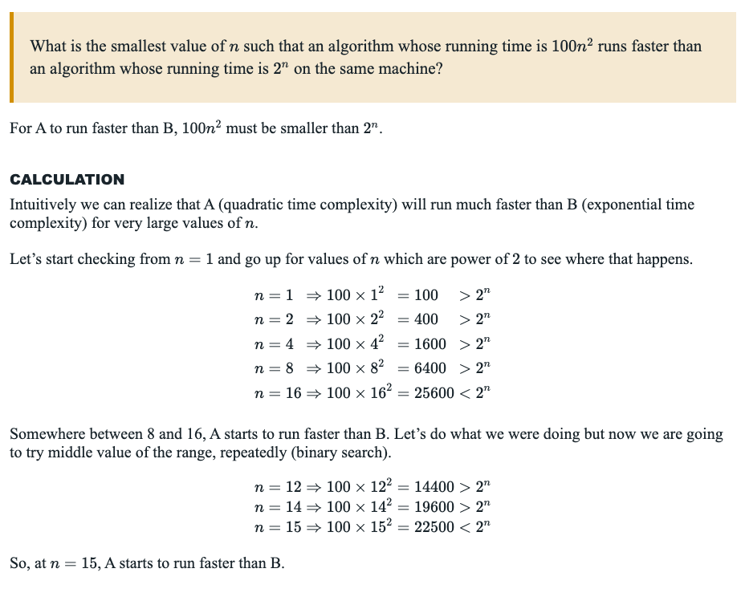

# Chapter 1 - The Role of Alogrithms in Computing

- Algorithm: Any well-defined computational procedure that takes some value, or set of values, as input and produces some value, or set of values, as output.

- Instance: The input (satisfying whatever constraints are imposed in the problem
  statement) needed to compute a solution to the problem.

- Correct Algorithm: For every input instance, it halts with the correct output.

- Data Structures: A way to store and organize data in order to facilitate access and modifications.

- NP-complete Problems: Problems for which no efficient solution is known.

- Parallelism: Modern processors contain _cores_ which work in parrallel to complete work simultaneously.

Exercises:

- 1.1-1:

A real world example that requires sorting is using filters on data for Web applications like shopping products. Sorting via size, cost, type, color, etc. 

A real world example that requires computing a convex hull would be for many constructions projects for fencing or land surveying.

- 1.1-2

Other than speed, some other measures of efficiency in the real-world are energy consumption, realism/feasibility, cost/budget, space/memory, scaleability, maintainability, flexibility, etc.

- 1.1-3

- Data Structure: set()
    - Pros:
        - Fast look-up
        - Easy insertion/deletion
        - If needed, unique items
    - Cons:
        - Unordered, no sorting in place
        - Can't access via index

- 1.1-4

The shortest path and traveling salesman problems are similar in that they both involve finding optimized paths from location to location, but the traveling salesman problem requires visits to all locations within the desired destination list and a return back to the starting place, or depot forming a *roundtrip* movement.

- 1.1-5

    - A real-world problem in which only the best solution will do are:
        - Space travel computations where rounding errors or miscalculations could result in dramatic issues or even death.
        - Medical drug dosage calculations for cehmotherapies and anasthesia.
        - Airplane autopilot trajectory adjustments during critical maneuvers. 

    -   A real-world problem in which an estimate of the best solution is good enough is delivery driver routing, where the best route is computationally expensive and small deviations are usually acceptable and don’t cause serious consequences.

- 1.2-1

An example of an application that requires algorithmic content at the application level is GPS routing, such as Apple Maps or Google Maps. Functions of the algorithms involved include computing the shortest path, generating alternative routes, adjusting for traffic or weather conditions, and accounting for geographical or national road regulations.

- 1.2-2

n <= ~43.5

- 1.2-3

n = 15

