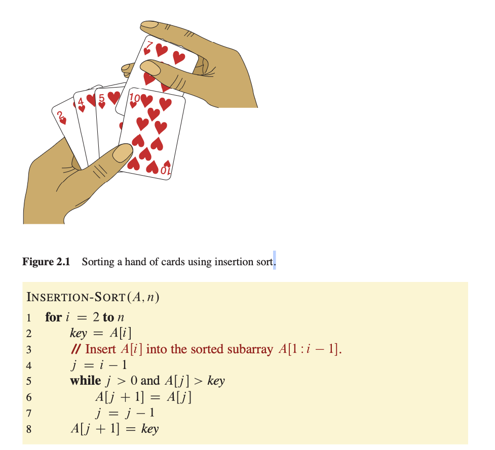
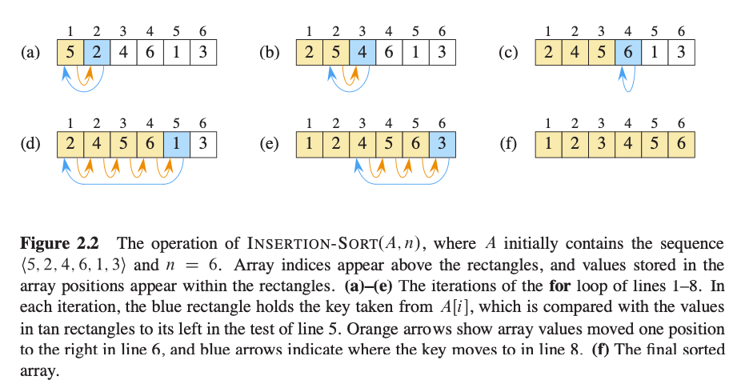
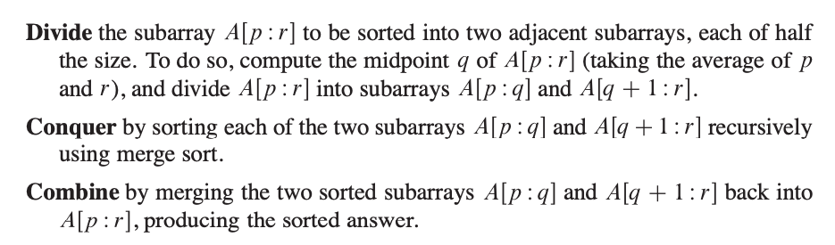
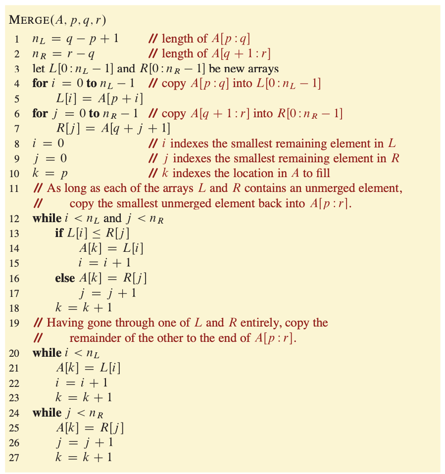
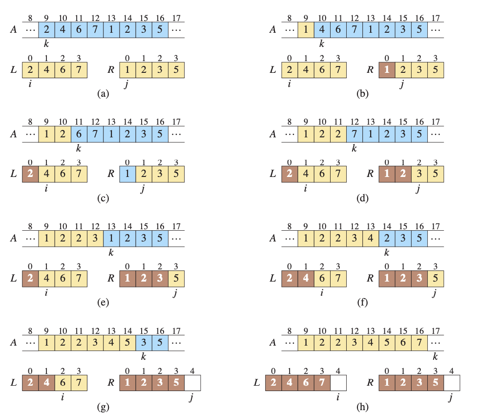
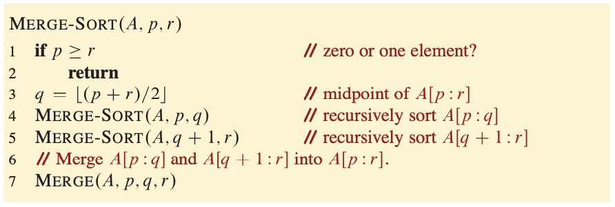

# Chapter 2 - Getting Started

- Insertion Sort: An efficient algorithm for sorting a **small** number of elements.
    - Record:
        - Keys:
        - Satellite Data:
    - Loop Invariant: a property or condition that is true before the loop begins, remains true before and after each iteration of the loop, and helps to show correctness when the loop terminates.
        1. Initialization: It is true prior to the ûrst iteration of the loop.
        2. Maintenance: If it is true before an iteration of the loop, it remains true before the next iteration.
        3. Termination: The loop terminates, and when it terminates, the invariant, usually along with the reason that the loop terminated, gives us a useful property that helps show that the algorithm is correct.

- Objects:
    - Attributes:

## 2.2 Analyzing Algorithms

- RAM (Random-access Machine) Model:

- Running Time: The number of instructions and data accesses executed.

Θ-notation (theta): Highlights the order of growth of the running time.

## 2.3 Designing Algorithms

- Incremental Method

- Divide-and-conquer Method: 
    1. Divide
    2. Conquer
    3. Combine

- Merge Sort: Sorts a subarray A[p:r], starting with the entire array A[1:n] and recursing down to smaller and smaller subarrays.

- Recurrence Equation (Recurrence): Describes the overall running time on a problem of size n in terms of the running time of the same algorithm on smaller inputs.
