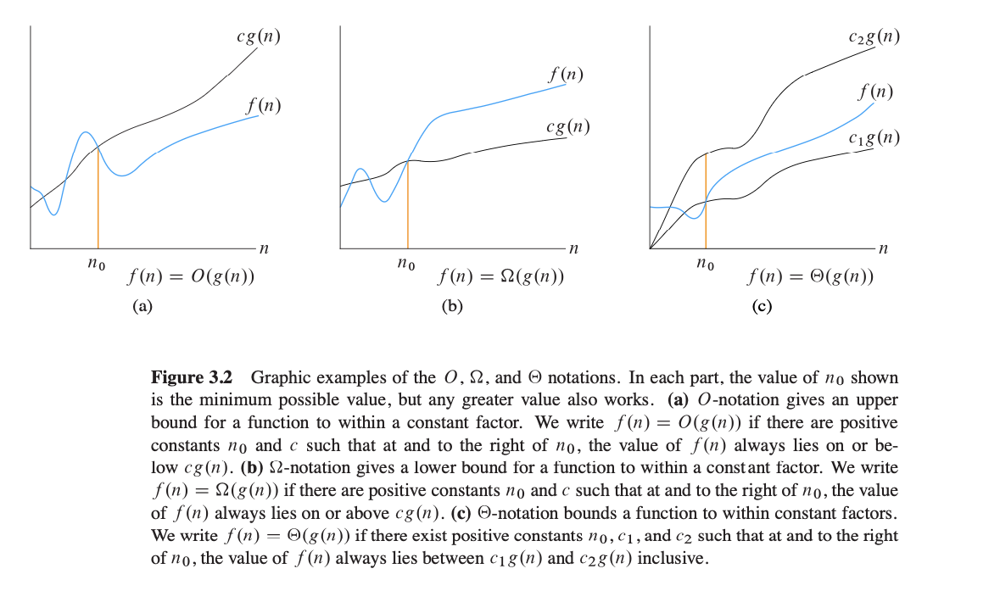
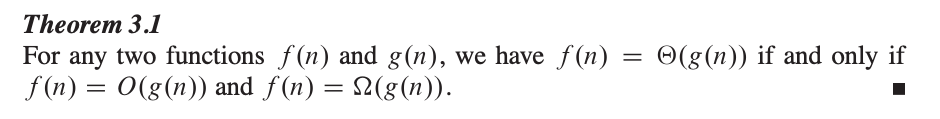

# Chapter 3 - Characterizing Running Times

- Asymptotic Efficiency: Input sizes large enough to make relevant only the order of growth of the running time.

## 3.1 O-notation, -notation, and ‚-notation

- O-notation: Characterizes an upper bound on the asymptotic behavior of a function.
    - A function grows no faster than a certain rate, based on the highest-order term.

- -notation: Characterizes a lower bound on the asymptotic behavior of a function.
    -  A function grows at least as fast as a certain rate, based, once again, on the highest-order term.

- Θ-notation: Characterizes a tight bound on the asymptotic behavior of a function.
    - A function grows *precisely* at a certain rate, based, once again, on the highest-order term.

## 3.2 Asymptotic notation: formal deûnitions

- o-notation

- w-notation