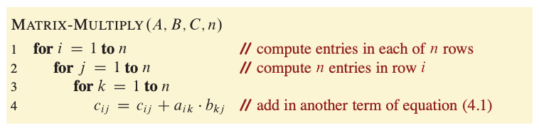
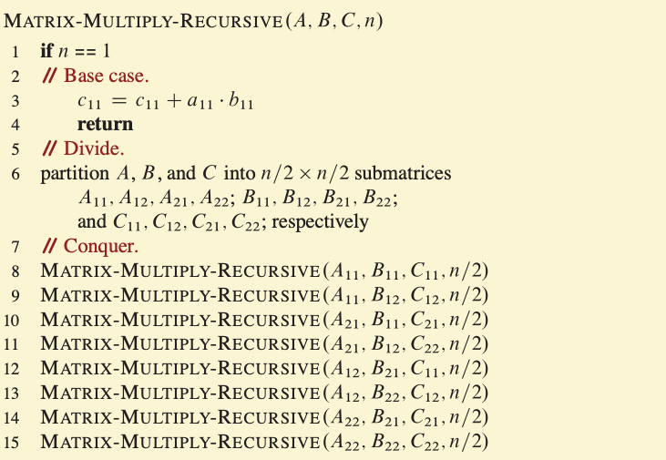
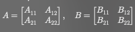
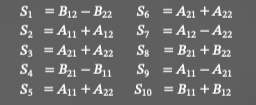
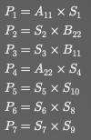
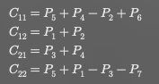

# Chapter 4 - Divide-and-Conquer

- **Divide-and-Conquer** is a powerful strategy for designing asymptotically efficient algorithms w/ 3 steps:
    1. *Divide* the problem into one or more subproblems that are smaller instances of the same problem.
    2. *Conquer* the subproblems by solving them recursively.
    3. *Combine* the subproblem solutions to form a solution to the original problem.

- **Base Case**: The simplest possible instance of the problem that can be solved directly without further recursion. (The “stop condition.”)
- **Recursive Case**: The step where the problem is reduced into smaller subproblems of the same type, moving it closer to the base case.

- **Recurrence**: An equation that describes a function in terms of its
value on other, typically smaller, arguments.

- 4 Methods for Solving Recurrences:
    1. Substitution Method:
    2. Recursion-tree Method: 
    3. Master Method: 
    4. Akra-Bazzi Method: 

## 4.1 Multiplying Square Matrices

- **Dense Matrix**: Most of the n2 entries are nonzero.  
    - Meaning we need to store nearly all n2 entries directly in the *n × n* array.  

- **Sparse Matrix**: Most of the n2 entries are 0, so the nonzero entries can be stored more compactly than in an *n × n* array.  
    - If the majority of the n2 entries are 0, we only store the nonzero values.  
        - However, we must also store the **locations (indices)** of these nonzero values so that the matrix can be reconstructed when needed.

## 4.2 Strassen's Algorithm for Matrix Multiplication

- Strassen's Algorithm for Matrix Multiplication improves upon the divide-and-conquer approach for *n x n* matrix multiplication.

    - 2 *n x n* matrices *A* and *B*, where *n* is a power of 2 (if not pad the matrices with 0's until satisfied).

    1. Base Case: *n = 1*
        - Multiply the 2 numbers directly and return.
        - *C = A x B*
    2. Divide (Partition the matrices)
        - Split *A* and *B* into **four** *(n/2) x (n/2)* submatrices.
        
        
    3. Form 10 helper matrices (S1...S10)
        - Use sums/differences of submatrices:
        
        
    4. Compute 7 Recursive Multiplications (P1...P7)
        - Each multiplication here is recursive, reducing the problem size to *n/2*
        
        
    5. Combine results to form *C* (the output matrix)
        - Compute the four quadrants of *C*:
        
        
    6. Return
        Combine C11, C12, C21, C22 into the full *n x n* result matrix *C*.
    
- Complexity

## 4.3 The substitution method for solving recurrences

- Substitution Method: A way to prove the runtime of a recursive function by:
    1. Guess a bound for *T(n)*, e.g, *T(n) = O(n)* or *T(n) <= cn* for some constant *c*.
    2. Use mathematical induction to prove that the guess is correct.
    
