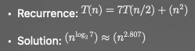

# Chapter 4 - Divide-and-Conquer

- **Divide-and-Conquer** is a powerful strategy for designing asymptotically efficient algorithms w/ 3 steps:
    1. *Divide* the problem into one or more subproblems that are smaller instances of the same problem.
    2. *Conquer* the subproblems by solving them recursively.
    3. *Combine* the subproblem solutions to form a solution to the original problem.

- **Base Case**: The simplest possible instance of the problem that can be solved directly without further recursion. (The “stop condition.”)
- **Recursive Case**: The step where the problem is reduced into smaller subproblems of the same type, moving it closer to the base case.

- **Recurrence**: An equation that describes a function in terms of its
value on other, typically smaller, arguments.

- 4 Methods for Solving Recurrences:
    1. Substitution Method:
    2. Recursion-tree Method: 
    3. Master Method: 
    4. Akra-Bazzi Method: 

## 4.1 Multiplying Square Matrices

- **Dense Matrix**: Most of the n2 entries are nonzero.  
    - Meaning we need to store nearly all n2 entries directly in the *n × n* array.  

- **Sparse Matrix**: Most of the n2 entries are 0, so the nonzero entries can be stored more compactly than in an *n × n* array.  
    - If the majority of the n2 entries are 0, we only store the nonzero values.  
        - However, we must also store the **locations (indices)** of these nonzero values so that the matrix can be reconstructed when needed.

## 4.2 Strassen's Algorithm for Matrix Multiplication

- Strassen's Algorithm for Matrix Multiplication improves upon the divide-and-conquer approach for *n x n* matrix multiplication.

    - 2 *n x n* matrices *A* and *B*, where *n* is a power of 2 (if not pad the matrices with 0's until satisfied).

    1. Base Case: *n = 1*
        - Multiply the 2 numbers directly and return.
        - *C = A x B*
    2. Divide (Partition the matrices)
        - Split *A* and *B* into **four** *(n/2) x (n/2)* submatrices.
        
        
    3. Form 10 helper matrices (S1...S10)
        - Use sums/differences of submatrices:
        
        
    4. Compute 7 Recursive Multiplications (P1...P7)
        - Each multiplication here is recursive, reducing the problem size to *n/2*
        
        
    5. Combine results to form *C* (the output matrix)
        - Compute the four quadrants of *C*:
        
        
    6. Return
        Combine C11, C12, C21, C22 into the full *n x n* result matrix *C*.
    
- Complexity

## 4.3 The substitution method for solving recurrences

- Substitution Method: A way to prove the runtime of a recursive function by:
    1. Guess a bound for *T(n)*, e.g, *T(n) = O(n)* or *T(n) <= cn* for some constant *c*.
    2. Use mathematical induction to prove that the guess is correct.
    
## 4.4 The recursion-tree method for solving recurrences

- Recursion Tree: Each node represents the cost of a single subproblem somewhere in the set of recursive function invocations.
    - Typically sum the costs within each level of the tree to obtain the per-level costs, and then you sum all the per-level costs to determine the total cost of all levels of the recursion.

- Example:

### Recursion Tree Method (Section 4.4) - Quick Review ###

- **What it is**
  - A visual tool for analyzing the running time of recursive algorithms.
  - Draw a tree where each node represents a subproblem.
  - The root corresponds to the original problem.
  - Children nodes correspond to recursive calls, usually smaller in size.

- **Subproblem properties**
  - Each node has:
    - Cost at that node: work done outside recursion (`f(n)`)
    - Size reduction factor: how the problem shrinks at each recursive call (e.g., `n/2`)
    - Multiplicity factor: how many children (e.g., 2 recursive calls → multiplied by 2)

- **Summing up costs**
  - Total running time \(T(n)\) = sum of costs of all nodes in the tree:
    
    T(n) = cost at root + sum of all internal nodes + sum of leaves
  - The dominant cost can come from:
    - The root (top of recursion)
    - Internal nodes (middle levels)
    - Leaves (bottom of recursion)

- **Insights**
  - By analyzing how costs shrink or multiply at each level, we can identify which level dominates the total running time.
  - This connects directly to the Master Theorem cases:
    - Root dominates → Case 3
    - Leaves dominate → Case 1
    - Everything balanced → Case 2

- **Why it’s useful**
  - Helps see patterns in recursive calls.
  - Makes it easier to guess asymptotic bounds before formally proving them (e.g., using the substitution method).
  - Provides intuition for how splitting factors and number of recursive calls affect runtime.

## 4.5 The master method for solving recurrences

- Theorem 4.1 (Master theorem): Let *a* > 0 and *b* > 1 be constants, and let *f(n)* be a driving function that is defined and nonnegative on all sufficiently large reals.

- Watershed Function:  Represents the cost of all recursive subcalls together.
    - Case 1 applies if the watershed function grows asymptotically faster than the driving function.
    - Case 2 applies if the two functions grow at nearly the same asymptotic rate.
    - Case 3 applies when the driving function grows asymptotically faster than the watershed function.

- What the theorem is teaching us?

- The Master Theorem is teaching you how to quickly classify recurrences by comparing two functions:
    - The recursion cost: 
    - The non-recursion cost: *f(n)*

- Depending on which grows faster, you pick the case:
	- Case 1: Recursive calls dominate.
	- Case 2: Balanced — both matter.
	- Case 3: Non-recursive work dominates.

### Master Method (Section 4.5) - Quick Review ###

- **What it is**
  - A general technique for solving recurrences of the form: 
  
      - `a > 0` = number of subproblems
      - `b > 1` = factor by which problem size decreases
      - `f(n)` = work done outside recursion (driving function)
  - Quickly identifies running times without fully expanding recursion trees.
  - Uses the **watershed function**: , representing the work from recursion itself.

- **Intuition**
  - Compare the driving function `f(n)` to the watershed function :
    - `f(n) << watershed` → recursion dominates → Case 1  
    - `f(n) ~ watershed` → balanced → Case 2  
    - `f(n) >> watershed` → extra work dominates → Case 3
  - The “polynomially larger or smaller” condition ensures a meaningful separation in growth rates.

- **Why it’s useful**
  - Quickly determines asymptotic runtime without drawing full recursion trees.
  - Provides a **shortcut** for many common divide-and-conquer recurrences.
  - Bridges intuition from recursion trees to formal bounds in a systematic way.

## 4.6 Proof of the continuous master theorem

## 4.7 Akra-Bazzi recurrences

